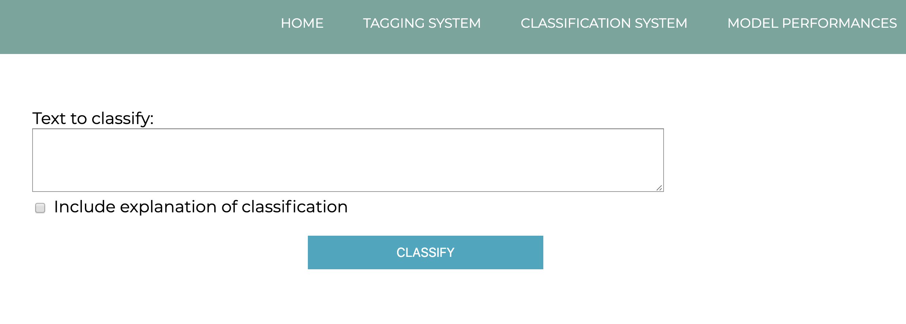

# CyberBullying

Requirements for the Web Frontend: Node.js

There are 2 folders: ‘CyberBullying’ and ‘Frontend’. ‘CyberBullying’ is the project written in python3.7. 'Frontend' is inside 'CyberBullying' and contains Angular 7 app.

To install the CyberBullying package and use it’s functionality please write:
‘pip install -e path/to/CyberBullying’
after the installation you can go to python terminal and import the package with:
‘import CyberBullying’

## Play with the Frontend:
First you need to run the web service with python terminal:
‘from CyberBullying.WebService import main’

Then navigate to the Frontend directory in the command line and run:
‘npm install’
‘ng serve -o’

This should open chrome browser with the project’s website.
Click on ‘classification system’ and write anything you’d like in the text area (only Hebrew text) and press classify. 
You can check the ‘include explanation…’ to get the explanation of the classification:

 

To use the api in python you can import it with 
“from CyberBullying import api”
and call its functions according to the API definition in the project book.

## Experiment script

In the source/CyberBullying folder there is a file name 'experiment.py'. You can run it to see outputs of the system's algorithms performance.

## Please note

This repository does not cotain the trained models ans the Word2Vec trained models or corpus. 
Please contact as for the files.
